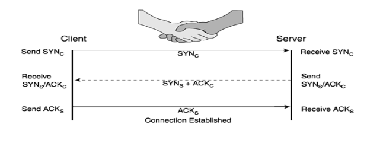

# TCP

TCP là một giao thức hướng kết nối đáng tin cậy được sử dụng cho truyền dữ liệu. TCP sử dụng cơ chế sau:
- **Kết nối TCP là unicast (duy nhất))**. Khi một phiên TCP (sesion) được thiết lập, kết nối đó là duy nhất và độc quyền giữa hai máy (chỉ hai máy sử dụng kết nối TCP đó).  Việc sử dụng phiên duy nhất (unique sesion) cho phép cả hai bên theo dõi lưu lượng trên đường truyền.
- **TCP sequence numbers**: TCP gán số thứ tự cho các phân đoạn được gửi. Số thứ tự này được sử dụng để xác định phân đoạn dữ liệu (gói tin) có đi được đến đích hay không. Gói tin TCP có thể được nhận với thứ tự khác với thứ tự gửi nên số thứ tự còn có nhiệm vụ giúp ghép nối các gói tin với nhau.
- **Phản hồi ACK**: ack được sử dụng để thông báo cho người gửi rằng dữ liệu đã được nhận. ACK kết hợp với sequence number để thông báo cho người gửi các gói tin nào được nhận và gửi lại gói tin bị drop.

## Thiết lập kết nối TCP
TCP tạo kết nối thông qua quy trình bắt tay 3 bước  

- Gói tin với cờ SYN được bật thông báo cho việc tạo kết nối mới.
- Gói ACK được sử dụng để thông báo các máy sẵn sàng kết nối.
- Dữ liệu chỉ được truyền qua lại sau khi kết nối thành công.
- Các ứng dụng khác nhau sử dụng các phiên kết nối TCP khác nhau dựa trên ip:port nguồn và đích (socket).
- Trên thực tế , có hai kết nối đã được thiết lập; kết nối từ S-> C và kết nối C->S. Điều này do TCP là song công, có nghĩa là dữ liệu di chuyển theo hai hướng độc lập.
 
