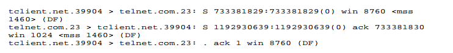
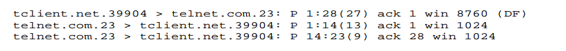

# TCP

TCP là một giao thức hướng kết nối đáng tin cậy được sử dụng cho truyền dữ liệu. TCP sử dụng cơ chế sau:
- **Kết nối TCP là unicast (duy nhất))**. Khi một phiên TCP (sesion) được thiết lập, kết nối đó là duy nhất và độc quyền giữa hai máy (chỉ hai máy sử dụng kết nối TCP đó).  Việc sử dụng phiên duy nhất (unique sesion) cho phép cả hai bên theo dõi lưu lượng trên đường truyền.
- **TCP sequence numbers**: TCP gán số thứ tự cho các phân đoạn được gửi. Số thứ tự này được sử dụng để xác định phân đoạn dữ liệu (gói tin) có đi được đến đích hay không. Gói tin TCP có thể được nhận với thứ tự khác với thứ tự gửi nên số thứ tự còn có nhiệm vụ giúp ghép nối các gói tin với nhau.
- **Phản hồi ACK**: ack được sử dụng để thông báo cho người gửi rằng dữ liệu đã được nhận. ACK kết hợp với sequence number để thông báo cho người gửi các gói tin nào được nhận và gửi lại gói tin bị drop.

## Thiết lập kết nối TCP
TCP tạo kết nối thông qua quy trình bắt tay 3 bước  

- Gói tin với cờ SYN được bật thông báo cho việc tạo kết nối mới.
- Gói ACK được sử dụng để thông báo các máy sẵn sàng kết nối.
- Dữ liệu chỉ được truyền qua lại sau khi kết nối thành công.
- Các ứng dụng khác nhau sử dụng các phiên kết nối TCP khác nhau dựa trên ip:port nguồn và đích (socket).
- Trên thực tế , có hai kết nối đã được thiết lập; kết nối từ S-> C và kết nối C->S. Điều này do TCP là song công, có nghĩa là dữ liệu di chuyển theo hai hướng độc lập.
 
 

Trong record trên, client telnet.net kết nối đến server telnet.com.  
Bản ghi đầu tiên chứa các thông tin: 
- kết nối từ tclent.net -> telnet.com được yêu cầu từ phía client bằng gói tin TCP chỉ có cờ SYN (S)
- **win 8760**: báo rằng client có bộ nhớ buffer 8760bytes để chứa dữ liệu
- **<mss 1460>**: (maximum segment size) báo rằng client sử dụng kết nối chỉ nhận được gói tin có kích thước tối đa của payload là 1460 bytes. Có nghĩa là client sử dụng kết nối ethernet có MTU là 1500, truyền dẫn được frame có kích thước tối đa 1500 bytes (bao gồm: 20bytes IP header + 20 byte TCP header + 1460bytes tcp payload).
- 73xxxx:73xxx (0): segment number. (0) xác định rằng gói tin có kích thước payload là 0.

Bản ghi thứ hai:
- server trả lời client với gói tin TCP có cờ SYN ACK.
- sequence number là 119xx báo hiệu số thứ tự gói tin đầu tiên của server. 
- ack 733xx30 là số xác nhận ACK (acknowledgement number). Giá trị này là ISN của client + 1 hay server muốn đã sẵn sàng kết nối và báo cho cleint gửi gói tin thứ 77xx30 đến.

Bản ghi thứ 3:
- client gửi ACK cuối cùng đến server với acknowledgement number indicate (giá trị tương đối) là 1. Chỉ ra rằng cleint mong đợi byte đầu tiên từ server. Lúc này, giá trị tương đối được sử dụng thay cho giá trị tuyệt đối.
- sau dấu : là placeholder ('.') và không có bit PUSH, RESET, SYN hoặc FIN nào được đặt.

---

# PORT

Trong quá khứ, các dịch vụ của server thường có cổng từ 1-1023. Đối với Unix trước đó, cũng cần có quyền root mới mở được các cổng nhỏ hơn 1024 này. Tuy nhiên hiện tại, số lượng dịch vụ đã lớn hơn con số 1024. Vì vậy, có một số dịch vụ phía server sử dụng cổng lớn hơn 1024. Mỗi port được sử dụng cho một service và thường là cố định

Client port thường lớn hơn 1023 và các port này được dùng không cố định.
Khi hai người dùng một host kết nối đến cùng một server, hai người này được cấp hai cổng khác nhau để  máy chủ phân biệt được kết nối.

---
# Ngắt kết nối.
CÓ hai cách để ngắt kết nối:
- graceful: khi ngắt kết nối, một trong hai máy (client hoặc server) sẽ gửi gói tin có cờ FIN. Máy còn lại gửi gói tin ACK để xác nhận ngắt kết nối 1 chiều (ví dụ: server gửi FIN thì Client gửi ACK, kết nối phía server -> client được ngắt).  
Sau đó, máy tính vừa gửi ACK sẽ gửi tiếp một gói tin FIN, ACK để thông báo ngắt kết nối chiều còn lại. Và máy tính kia sẽ gửi ACK để thông báo sẽ ngắt kết nối.
  
- abrupt: một host sẽ gửi gói tin TCP với cờ RESET (R). Khi đó, kết nối sẽ được ngắt ngay lập tức.

---
# Truyền dữ liệu:
Qúa trình truyền dữ liệu được thực hiện sau khi kết nối TCP được thiết lập.

Ví dụ kết nối nhu hình chứa các thông tin sau:
- Dòng 1
    - Gói tin gửi từ Client -> Server với size là 27bytes với cờ PUSH được bật. Do telnet là ứng dụng tương tác yêu cầu thời gian phản hồi sớm nhất. Trong trường hợp này, dữ liệu được server nhận và xử lí ngay lập từ khi bộ nhớ đệm nhận được gói tin.
    - DÒng này cũng có ack number là 1 cho biết gói tin tiếp theo client mong muốn nhận từ server có squence number là 1.
- Dòng record 2:
    - Server gửi 13 bytes đến client và acknumber là 1. Nó thông báo rằng muốn nhận gói tin với sequnce number là 1 . Điều này đồng nghĩa là server chưa nhận được 27 bytes dữ liệu mà client gửi.
- Dòng record 3:
    - Server đã nhận được dữ liệu từ phía client, gửi 9 byte dữ liệu về client và thông báo ack 28 cho biết server đang đợi gói tin bắt đầu từ byte 28 từ client.

