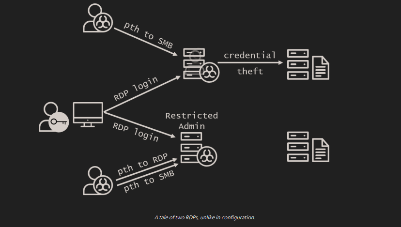

nguồn : labs.f-secure.com
# Introduction
Originally introduced for Windows 8.1 and Server 2012 R2, Restricted Admin mode is a Windows feature that prevents storing an RDP user’s credentials in memory on the machine to which an RDP connection is made. In practice, this will prevent users (usually admins) from having their credentials read out of memory after RDPing into a compromised host.

To prevent credentials from being stored on the remote machine, Restricted Admin changes the Remote Desktop protocol so that it uses network logons rather than an interactive logons for authentication. With this protection, establishing an RDP session will not require the associated password to be provided; instead the NT hash or Kerberos ticket of the user will be used for authentication.

Restricted Admin for both clients and servers has been backported to Windows 7 and Server 2008 but remains disabled by default on most standard Windows builds due to a couple of caveats surrounding its use.

# Pass the hash... to RDP?
Restricted Admin mode for RDP was created as a further mitigation for pass the hash, a weakness in Windows domain authentication enabling many lateral movement techniques. Ironically, shortly after the control was released, security researchers found that it led to a whole new pass-the-hash vector. Because it uses network rather than interactive logons, it allows for a pass-the-hash attack against the Remote Desktop protocol itself. This means that an attacker can gain access to a remote desktop session with only a valid user’s password hash and not their plaintext password.

But this is not as bad as it may seem. While Restricted Admin mode may allow an attacker to login via RDP using pass the hash, an attacker would be able to use the more classic and conventional pass-the-hash attack on SMB anyway, regardless of whether Restricted Admin was enabled or not. Port 445 or port 3389, the results would be the same. Except, with Restricted Admin mode enabled, our attacker wouldn’t be able to parlay an initial breach into lateral movement by compromising additional remote administrator credentials. The difference is illustrated in the diagram below.

Enabling pass the hash to one more port may be worth it to protect user credentials in this way.

# Credential caching: not just for Mimikatz
A more practical reason to avoid Restricted Admin mode is that functionality such as Single Sign-On systems and fileshares expect the current user’s credentials to be cached in memory, the very thing Restricted Admin prevents. On hosts which rely heavily on this sort of functionality, Restricted Admin mode may not be a feasible control.

# What about tiering?
The argument has been made that Restricted Admin mode is not necessary if you follow security best practices for AD tiering (see step 5 of our article, Planting the Red Forest). In a best-practice tiering model, administrators avoid compromise by never using more trusted, more privileged accounts to log into less trusted, less privileged hosts – the exact use case Restricted Admin is designed to secure.

So while this criticism is largely correct, practically speaking, the rollout of Restricted Admin mode is likely to be a far simpler exercise than that of a robust tiering model. This makes Restricted Admin mode a highly worthwhile quick win for organizations still navigating the outskirts of the Red Forest.

Even with effective tiering, however, Restricted Admin can still be a useful control to protect privileged accounts for specific use-cases such as:

Helpdesk users who need to remotely log in to workstations over which individual users have local admin privileges.

Incident response investigators who need to remotely log in to potentially compromised workstations.

# Undisable Restricted Admin
We consider Restricted Admin mode an effective control to prevent the spread of administrative credentials across the network, thus making lateral movement more difficult, particularly in environments where tiering is not yet in place or has not yet been fully implemented. The extra protection it offers in such environments far outweighs the risk of the additional pass-the-hash attack vector it exposes, as, in most environments, pass the hash will be possible regardless.

Restricted Admin mode can be enabled on target systems by adding the following double-negative registry key:  

| | |
| --- | --- |
| Location | HKEY_LOCAL_MACHINE\ System\ CurrentControlSet\ Control\ Lsa |
| Name | DisableRestrictedAdmin |
| Value | 0x0 |

To force clients to only connect to remote systems if Restricted Admin mode is available, set the following GPO setting through Computer Configuration:

| | | 
| --- | ---|
| Location | Policies → Administrative Templates → System → Credentials Delegation |
| Name | Restrict delegation of credentials to remote servers |
| Setting | Enabled | 
| Restricted mode | Require Restricted Admin |
This GPO setting will force clients to connect to remote systems using Restricted Admin and will block connections without Restricted Admin, so it should be deployed with care to avoid breaking things.

This restriction can also be enforced on an ad-hoc basis by running the following command to start the remote desktop client:

`mstsc /restrictedadmin`