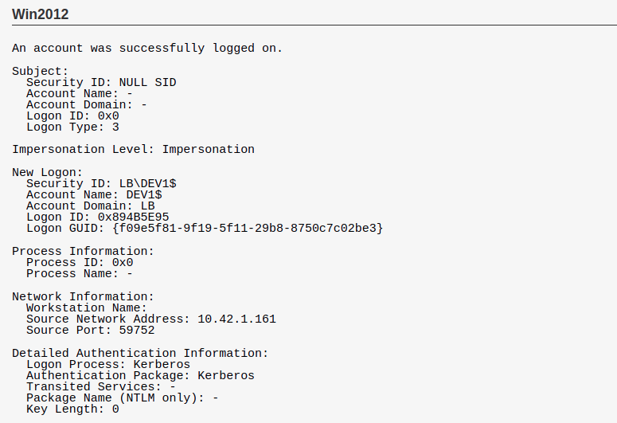

# Logon event 4624

## About
Logon event được ghi lại khi có sự kiện đăng nhập. Trong windows, có hai loại đăng nhập:
- Local SAM account logon: đăng nhập và xác thực với tài khoản local.  
Lọai đăng nhập này được sử dụng trên máy trạm và log được lưu trữ trong máy trạm (workstation)
- Domain account logon: đăng nhập và xác thực với tài khoản trong domain. Các log đăng nhập được ghi lại trên Security log của máy chủ. Vì vậy, mặc dù các sự kiện đăng nhập tài khoản trong domain được tập trung tại DC, ta vẫn có thể tìm thấy các log này trên mọi hệ thống trong domain. (Làm rõ hơn)

## Mô tả event id 4624

### 1. Phần subject:
phần này xác định tài khoản yêu cầu đăng nhập. Phần này thường là Null hoặc là một trong các Service principal và thường chứa thông tin không hữu ích. Phần này chứa các trường
- Security ID
- Account Name
- Account Domain
- Logon ID

### 2. Phần Logon Information.
Phần này chứa các trường thông tin sau:  
- **Logon Type**: các giá trị có ý nghĩa như sau  

| Logon type | Mô tả |
| :---: | :--- |
| 2 | Xảy ra khi người dùng đăng nhập trên máy tính cục bộ thông qua xác thực với SAM |
| 3 | đăng nhập qua Network (share file hoặc xác thực qua domain) |
| 4 | Batch: thông qua bat script. ví dụ schedualed task |
| 5 | Service startup. Khi một service được chỉ định để chạy theo từng người dùng, service startup sẽ tạo một phiên đăng nhập trước tiên. Tuy nhiên, chỉ các người dùng thông thường mới tạo sự kiện này, các tài khoản đặc biệt như **Local System”, “NT AUTHORITY\LocalService”,  “NT AUTHORITY\NetworkService”,** sẽ không tạo ra logon session. Khi Logon sesion đóng, nó sẽ đi kèm event 4634. Nếu có 4625 với type 5 có nghĩa là tài khoản đăng kí đã đổi mật khẩu và service chưa được update theo. |
| 7 | Type 7 thông báo rằng máy được mở khóa từ màn hình khóa (trạng thái lock). Lưu ý khi switch user, logon type được ghi là 2 |
| 8 | **Network cleartext** xác thực thông qua network với mật khẩu được gửi dưới dạng bản rõ (chưa được băm). Không nên sử dụng loại xác thực này. Loại này xuất hiện khi đăng nhập ASP script với advapi hoặc qua basic authentication mode của IIS. |
| 9 | **New credentials-based logon** Sự kiện này xảy ra khi sử dụng lệnh RunAs. Lệnh này cho phép sử dụng phiên đăng nhập của bản thân dưới một user khác. Ví dụ truy cập vào một folder chia sẻ, tuy nhiên có một số tệp bạn không có quyền truy cập, bạn có thể sử dụng runas với một tài khoản khác có quyền để truy cập. (MS says "A caller cloned its current token and specified new credentials for outbound connections. The new logon session has the same local identity, but uses different credentials for other network connections.")|
| 10 | **RemoteInteractive** đăng nhập thông qua RDP |
| 11 | **CachedInteractive** khi logon trong domain, windows cache sẽ lưu lại các credential sử đụng để đăng nhập khi DC không khả dụng. Mặc đinh, WIndows lưu trữ 10-25 credential cuối cùng. Khi cố gắng đăng nhập trong lúc DC không khả dụng, Windows sẽ kiểm tra thông tin có trong cache và ghi nhật kí với type = 11 |

**Với Windows 10/2016 có thêm các trường sau**:
- **Restricted admin mode**: hạn chế admin được sử dụng để ngăn chặn tấn công sử dụng pass-the-hash. Bạn chỉ thấy trường này với logon type 10. Giá trị thông thường "-": không hạn chế. "Yes" : hạn chế được sử dụng.  
Xem thêm về [resrticted admin mode](2020-11-02-restricted-admin-rdp.md).

- **Virtual account**: Bình thường "NO". "YES" dùng để thông báo dịch vụ được cấu hình đăng nhập bằng virtual account. Chỉ đi kèm với type 5.
- **Elevanted TOken**: Yes hoặc No. Nó đặt giá trị là YES nếu user đăng nhập thuộc ADministrators-kind of.. "Kind of"  được áp dụng cho interactive logon, khi bạn đăng nhập với quyền admin và UAC được bật. Khi thực hiện đăng nhập, bạn sẽ nhận được 2 sesion logon:
    - Một phiên không có administrator SID và các đặc quyền liên quan đến secutiry token liên quan.
    - Một phiên có SID và tất cả các quyền bảo mật.
    - Mọi thứ bạn thực thi đều được thực hiện dưới phiên không có đặc quyền cho đến khi thực thi thứ gì đó dưới quyền admin.

## Impressionation Level (win2012 -> later)
